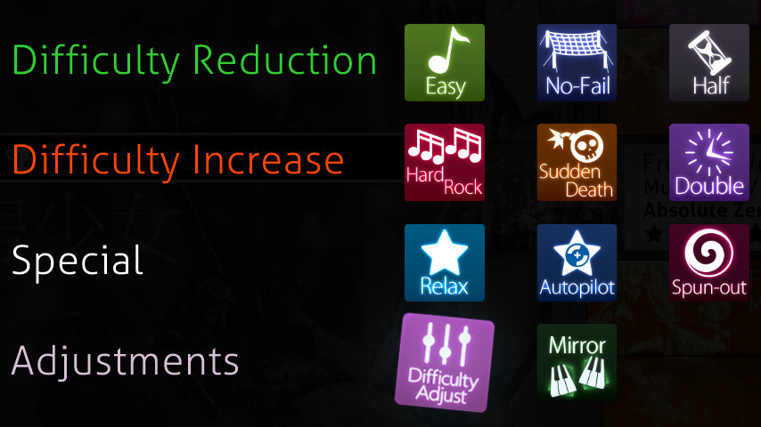
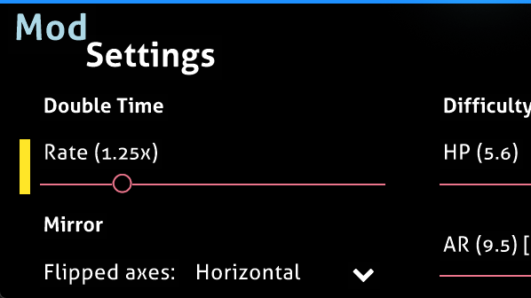
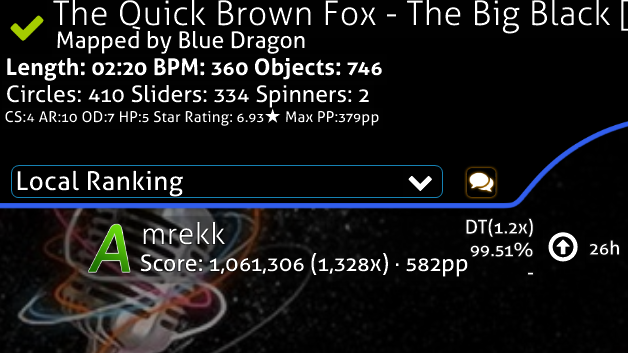
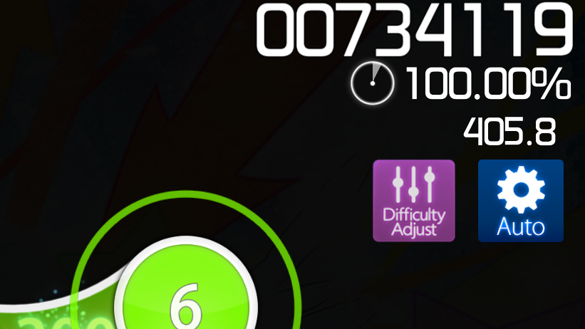

# osu!stable+

[](https://github.com/roquira/osu-stable-plus/actions/workflows/build.yml)
[](https://github.com/roquira/osu-stable-plus/releases/latest)
[](LICENSE)

osu!stable+ adds configurable mods and gameplay improvements to osu!stable.

It lets you change DT, NC and HT rates, adjust HP/CS/AR/OD, mirror beatmaps, and save those settings with your scores and replays. It can also import and export supported mod settings to and from osu!lazer.

The patcher modifies the existing osu!stable client at runtime and is based on [osu! patcher](https://github.com/rushiiMachine/osu-patcher) by [rushiiMachine](https://github.com/rushiiMachine).

> [!WARNING]
> **For offline play only. Do not use it while logged in.**

## Getting Started

### Installation

1. Download the latest release from the [Releases](../../releases) page.
2. Extract the archive somewhere outside your osu! installation.
3. Start osu!stable, then run `osu-stable-plus.exe`.
   * Or launch and patch osu! in one step with a [shortcut](.github/assets/installation/create-shortcut.png) to `"C:\path\to\osu-stable-plus.exe" --launch "C:\path\to\osu!.exe"`.

### Usage

Most gameplay settings are available directly from osu!'s **F1 mod menu**. Enable a supported mod and configure its settings from the **Mod Settings** drawer.

## Features

<table>
<tr>
<td width="50%">

### Difficulty Adjust & Mirror

Override individual beatmap difficulty settings without modifying the map.

* Adjust HP, CS, AR and OD in `0.1` increments
* Mirror maps horizontally, vertically or across both axes
* Integrated into the native mod menu
* Compatible with custom rates
<br>
</td>
<td width="50%" align="center">



</td>
</tr>

<tr>
<td width="50%" align="center">



</td>
<td width="50%">

### Custom DT, NC & HT rates

Choose your playback speed directly from the mod menu.

* **Double Time / Nightcore:** `1.01x–2.00x`
* **Half Time:** `0.50x–0.99x`
* Optional pitch adjustment
* Rate-aware BPM, length and difficulty display
<br>
</td>
</tr>

<tr>
<td width="50%">

### Scores & replays

Preserve custom gameplay settings in scores and replays.

* Custom rate and pitch metadata
* Difficulty Adjust and Mirror settings
* Import and export supported replays to and from osu!lazer
* Custom mod labels on local scores
<br>
</td>
<td width="50%" align="center">



</td>
</tr>

<tr>
<td width="50%" align="center">



</td>
<td width="50%">

### Gameplay & UI improvements

Additional gameplay and interface improvements for osu!stable.

* Official pp during gameplay and replays, local-score pp, and star ratings in all four modes
* Show Relax / Autopilot misses
* Automatic Sudden Death restart
* Settings accessible during gameplay with `Ctrl+O`
<br>
</td>
</tr>
</table>

## Compatibility

osu!stable+ is experimental and does not support the Cutting Edge release stream. Some game updates may require a new version.

Custom DT/NC/HT rates apply to all four modes. Difficulty Adjust and configurable Mirror apply to osu!standard; osu!mania retains its native column Mirror.

Some lazer-specific mechanics cannot be reproduced exactly in stable. Imported lazer and stable scores retain their original scoring scales.

## Development

The injector loads a hook into the running osu!stable process, which patches the game with [Harmony](https://github.com/pardeike/Harmony). pp and star ratings come from a separate helper that runs osu!lazer's official calculators.

### Requirements

* [.NET 8 SDK](https://dotnet.microsoft.com/)

### Build

```sh
dotnet restore Osu.StablePlus.Performance.Engine -r win-x64 -p:SelfContained=true
dotnet publish Osu.StablePlus.Injector -c Release -r win-x64 --self-contained true -o dist
```

Keep the `performance/` folder next to `osu-stable-plus.exe`.

### Tests

Run a test project with `dotnet run -c Release --project Osu.StablePlus.Tests`. Integration tests use the osu!stable folder in `OSU_PATH`; tests for specific maps or replays are skipped unless their `OSU_TEST_*` variables are set.

Run `dotnet format osu-stable-plus.sln` before committing; CI rejects formatting differences.

## License & Acknowledgements

osu!stable+ is licensed under [GPL-3.0](LICENSE) and based on [osu! patcher](https://github.com/rushiiMachine/osu-patcher) by [rushiiMachine](https://github.com/rushiiMachine).

Third-party licences and acknowledgements are listed in [CREDITS.md](CREDITS.md).
